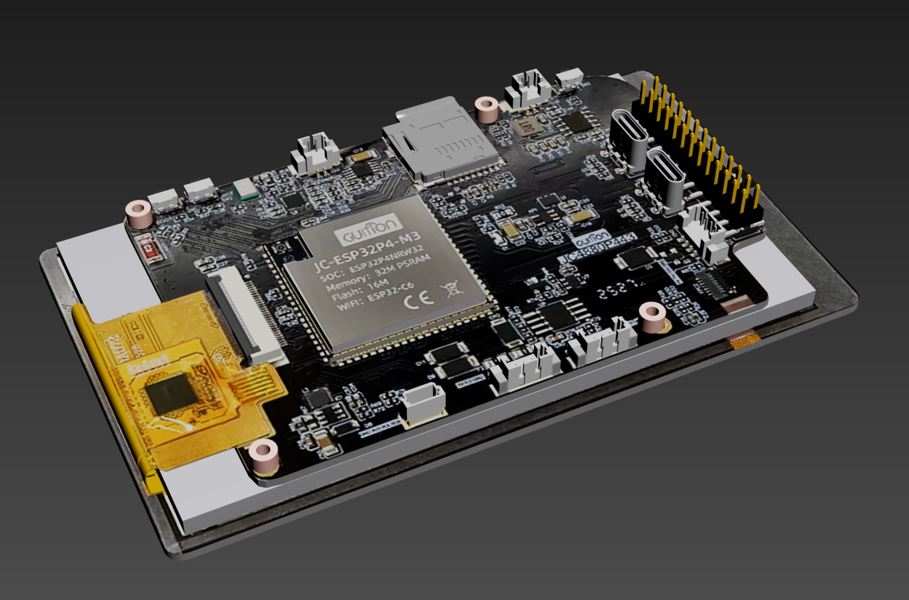
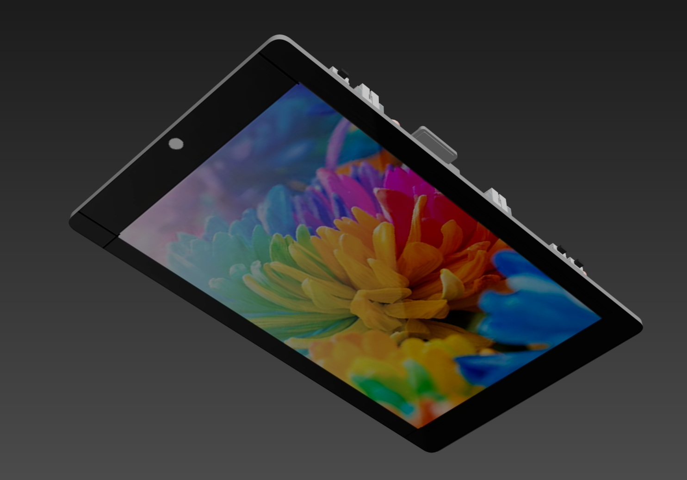
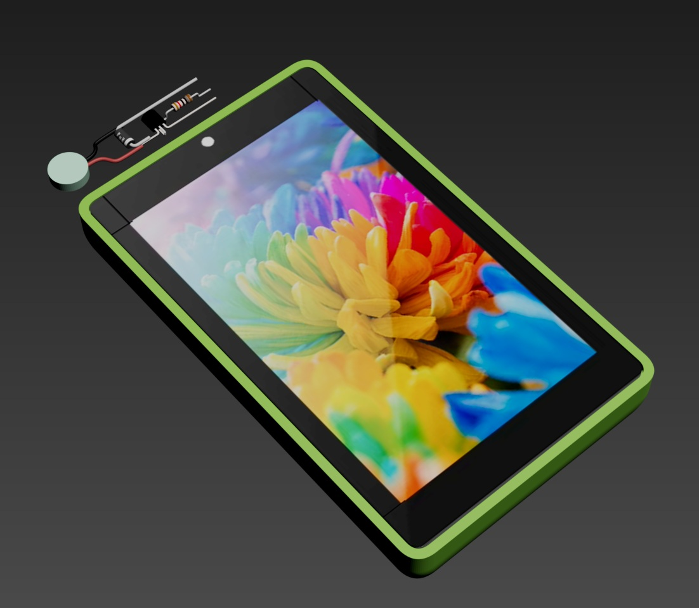
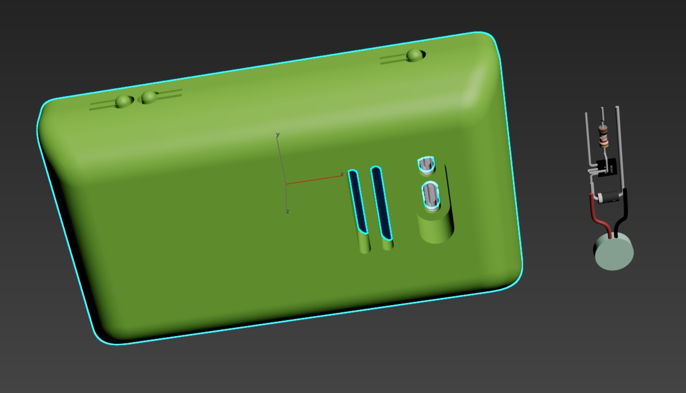
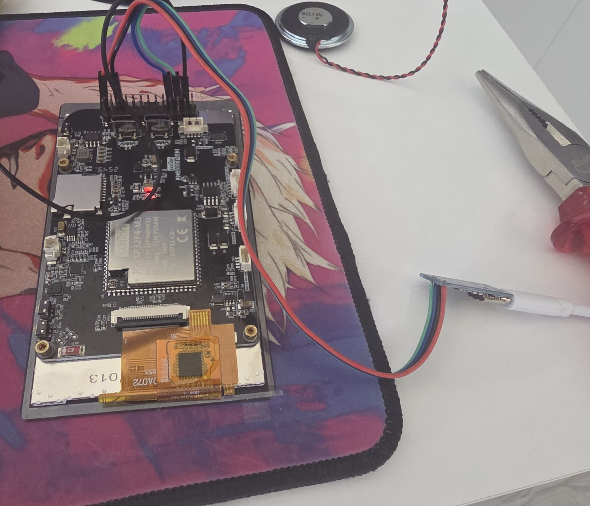

# JC4880P443C_I_W_Remote

Version 1.1.11 custom firmware for the JC4880P443C_I_W / ESP32-P4 Function EV Board profile.

This project keeps the Espressif phone-style launcher experience, then extends it with a broader native app set, emulator support, better SD-card behavior, persistent Wi-Fi settings, timezone control, online firmware discovery, a local factory reset flow, and an external ESP32-C6 coprocessor firmware path for BLE and ZigBee features.

## Hardware And Case Renders

Screen module views:




Battery and speaker case v1:




Printable STL files for the enclosure and related 3D assets are stored in `3D/`, including the original V1 files, the updated V2 and V3 case variants, separate lid / ring / fix parts, and editable Max or 3MF source files for the enclosure work.

## What Changed Versus The Vendor Base

Compared with the stock Espressif-based firmware stack used for this hardware profile, this build adds or changes the following:

- Files app for browsing both `/sdcard` and SPIFFS directly on the device.
- Internet Radio app with station discovery by popularity, country, language, and category.
- Native SEGA app with Master System, Game Gear, SG-1000, and Genesis / Mega Drive ROM support.
- Shared launcher icon set sized to fit the OTA partition budget.
- Persistent Wi-Fi credentials and reconnect behavior backed by NVS.
- Display timezone dropdown in GMT format with saved preference storage.
- Auto timezone detection from the internet after Wi-Fi connects.
- Firmware screen factory reset button with confirmation and settings wipe.
- Firmware releases now publish OTA-detectable `.bin` assets directly instead of ZIP-only packages.
- Safer SD-card boot behavior so video playback is only enabled when MJPEG content is actually present.
- SPIFFS cleanup that removes bundled demo media and frees flash for larger OTA-safe application images.
- Additional low-risk PSRAM placement for radio preview workers, background service stacks, and emulator lookup / ROM buffers to preserve internal SRAM for time-sensitive work.
- Internet radio buffering and MP3 recovery are more tolerant of malformed or slow streams, which reduces playback stalls.
- Firmware settings can browse GitHub releases directly and offer OTA updates from attached `.bin` assets.
- Dead launcher apps and unreachable video-player sources were removed to reduce maintenance surface and keep OTA builds within budget.
- Camera and 2048 were removed from the installed launcher set to reduce boot-time memory pressure and maintenance surface.
- MP3 probing and decode fallback behavior are more tolerant of malformed frames and stream sync loss.
- BLE and ZigBee features are now enabled through a matching ESP32-C6 coprocessor firmware release.
- The standalone ESP32-C6 release now includes the fixed ZigBee storage partition layout required for stable bring-up.
- Wi-Fi status in the top bar now follows real connection state and signal strength updates more reliably.
- The Wi-Fi settings page now uses an explicit full-width `Scan` action instead of background auto-scan, which avoids dropdown races and makes scan timing predictable.
- Saved networks now stay connectable without live availability gating, and failed attempts can fall back to the previously connected network instead of leaving the device disconnected.
- Intentional disconnect flows no longer trigger automatic reconnect recovery, so a manual disconnect can keep Wi-Fi offline until the user asks for another connection.
- BLE startup, teardown, and disconnect recovery on the ESP-Hosted path were hardened to avoid stuck startup states and disconnect-time crashes.
- The settings UI now includes compact Bluetooth and ZigBee status icons used by the latest wireless status flow.
- Settings now exposes separate Media and System Sounds volume controls on the shared audio output path.
- Files, Music, and Radio startup paths were hardened to avoid preallocating unnecessary runtime memory before launch.
- Internal SRAM usage was reduced substantially by moving large SEGA emulator permanent buffers and tables into PSRAM-backed BSS.
- Additional boot-time SRAM pressure was removed by deferring heavy Internet Radio, Image Display, and SEGA UI/runtime setup until first launch.
- The unused camera and deep-learning component stack was removed from the resolved build graph to reduce flash footprint and memory pressure.
- Settings shutdown and modal-close flows were hardened against stale LVGL object updates that could previously trigger a panic during screen teardown.
- Music Player runtime metadata, library indexes, and long-lived worker stacks now prefer PSRAM, which reduces launch-time and background SRAM pressure.
- Music Player playlist confirmation dialogs now use safe LVGL async-close handling to avoid the panic that could occur when deleting or cancelling from the modal.
- Quick-access controls now stay available while apps are open, with smaller launcher row icons and richer live Music Player detail in the strip.
- Internet Radio now mirrors Music Player-style top-bar quick actions for country station lists, including previous / next station controls and live buffering detail while the quick-access sheet is open.
- Internet Radio now exposes a live buffered-stream meter, larger playback modal layout, deeper PSRAM-first buffering, and delayed startup until the stream cache reaches a safer prefill level.
- Internet Radio steady-state downloading now refills in the background instead of blocking the audio playback path, which reduces refill-time audio dropouts on slow stations.
- Radio station catalogs, stream working buffers, and the shared audio playback task now prefer PSRAM more aggressively to preserve internal SRAM during radio use.
- Internet-backed Radio flows now fail fast when Wi-Fi has no usable IP or DNS, which avoids long timeout paths when the device is connected to Wi-Fi without real internet access.
- Radio app close/reopen handling now clears stale LVGL screen pointers on teardown, preventing the main-screen artifacts and close-time panic that could occur after failed online lookups.
- Panic behavior now reboots automatically, and the next boot shows a short recovery popup that distinguishes crash, watchdog, brownout, and CPU lockup resets.
- Flash-backed core dump capture is now enabled, and the next boot persists a readable crash report under SPIFFS for later developer analysis.
- The reboot recovery popup can now show a manual `Report` action that tries to submit the saved crash report when Wi-Fi is connected, otherwise it reports that the device is offline or the private relay is not configured.
- Additional enclosure revisions and raw CAD exports are included under `3D/` for the updated hardware fit iterations.

## Feature Summary

### Launcher And Native Apps

- Phone-style launcher UI based on ESP-Brookesia and LVGL.
- Settings, Calculator, Files, Music Player, Internet Radio, Image Display, and SEGA Emulator.
- SEGA Emulator app integrated into the launcher instead of living as a separate upstream project.

### Media And Storage

- Files app can inspect both onboard SPIFFS and the SD card.
- Music and image sample payloads were removed from SPIFFS to save flash.
- The firmware updater can scan `/sdcard/firmware` for local `.bin` images or check GitHub releases for OTA-ready `.bin` assets.

### Wi-Fi, Time, And Settings

- Saved Wi-Fi credentials persist across reboots and reconnect automatically.
- Wi-Fi scanning is now manual from Settings with a dedicated `Scan` button placed below the saved-network card.
- Pressing `Scan` while Wi-Fi is off turns Wi-Fi on first, then launches the scan through the normal init path.
- Saved networks remain connectable even if they are not in the latest scan result set.
- Failed switches to unavailable saved networks can restore the previously connected network automatically.
- Intentional disconnects no longer trigger unwanted reconnect attempts.
- Signal strength and scan results are exposed in Settings.
- System time is sourced from SNTP and converted with the configured local timezone.
- Manual timezone selection is available in GMT offsets.
- Auto timezone mode can update the offset from online geolocation when internet access is available.
- Factory Reset in Settings > Firmware clears the app preferences namespace and reapplies defaults immediately.

### Stability And Crash Recovery

- Panic and watchdog resets now reboot back into the launcher instead of halting on a dead screen.
- The next boot shows a short recovery popup with the general reset cause so failures are visible without opening a serial monitor.
- Core dumps are stored in a dedicated flash partition and summarized into a text crash report on boot.
- Crash reports are saved locally in SPIFFS and can be manually submitted from the recovery popup when Wi-Fi is available.

### Wireless Coprocessor

- BLE and ZigBee runtime support depends on the external ESP32-C6 coprocessor firmware published in the matching GitHub release.
- If the C6 is not flashed with the firmware from the same release, BLE and ZigBee features on the P4 side are not expected to work correctly.
- The C6 firmware is built from `coprocessor_c6/` and is released alongside the main P4 firmware.

### Emulator Support

- The SEGA app scans `/sdcard/sega_games` for `.sms`, `.gg`, `.sg`, `.md`, `.gen`, `.bin`, and `.smd` ROMs.
- SMS and Game Gear battery saves are written next to the ROM as `.sav` sidecars.
- Genesis / Mega Drive support is integrated through the adapted Gwenesis path.

## Hardware Target

- ESP32-P4 Function EV Board based target.
- 7-inch 1024x600 MIPI-DSI display using EK79007-compatible support.
- USB-C for power, flashing, and serial monitoring.
- Optional SD card for media, firmware packages, and emulator ROMs.

## Storage And OTA Layout

- Flash size is configured for 16 MB.
- Partition table provides OTA app slots of `0x7B0000` and `0x790000`, with the smaller slot defining the real OTA size ceiling.
- A dedicated `0x020000` flash coredump partition is reserved for post-crash diagnostics.
- SPIFFS storage remains `0x080000` while preserving the remaining onboard filesystem features.
- Version 1.1.11 validates at `0x64b4a0`, leaving `0x144b60` bytes free in the smaller OTA app slot.

## SD Card Layout

- `/sdcard/music` for music content.
- `/sdcard/image` for image content.
- `/sdcard/sega_games` for SEGA ROMs.
- `/sdcard/firmware` for local `.bin` firmware packages.

## Build

This project targets ESP-IDF 5.5.x and `esp32p4`.

```bash
idf.py set-target esp32p4
idf.py build
```

To flash and open the serial monitor:

```bash
idf.py -p PORT flash monitor
```

## VS Code Flash Target Switch

If you want one simple switch in VS Code to choose whether to flash the main P4 firmware or the external C6 firmware, use the local workspace settings and task created in `.vscode/settings.json` and `.vscode/tasks.json`.

Important:

- This repo keeps the root ESP-IDF target as `esp32p4`.
- Do not use the ESP-IDF status bar target picker to switch the root project to `esp32c6` just to flash the coprocessor.
- Instead, switch the local flash selector and run the matching task.

In `.vscode/settings.json`, change:

```jsonc
"jc4880.flashTarget": "p4"
```

Valid values are:

- `p4` to flash the main ESP32-P4 firmware.
- `c6` to flash the ESP32-C6 coprocessor firmware.

The local COM ports are configured with:

```jsonc
"jc4880.ports.p4": "COM10",
"jc4880.ports.c6": "COM12"
```

After changing the selector, run the VS Code task:

```text
JC4880: Flash Selected Target
```

That task flashes the latest built image for the selected target.

## C6 Firmware Requirement

BLE and ZigBee features require the ESP32-C6 coprocessor to be flashed with the matching firmware from the same GitHub release as the P4 firmware.

Use the release assets for both devices together:

- Flash the P4 with the P4 firmware from the release.
- Flash the C6 with the C6 firmware from the same release.
- Do not mix older C6 firmware with a newer P4 release if you expect BLE or ZigBee to work.

## Flashing The ESP32-C6



To flash the C6 from an external UART bridge, connect the bridge to the board header like this:

- `RX -> TX`
- `TX -> RX`
- `GND -> GND`
- `5V -> 5V`

To put the C6 into boot mode:

1. Pull `C6_IO9` to `GND`.
2. Connect USB to the PC.
3. Put the P4 side into boot mode as well so it does not interfere with the C6: press `BOOT` and `RST`, then release `RST` so the screen stays in boot mode.
4. Release `C6_IO9` from `GND`.
5. Flash the C6 firmware.

This sequence keeps the P4 out of the way while the external UART bridge talks directly to the C6.

## Project Layout

- `main/` boot flow and app installation.
- `components/apps/` native applications and emulator integration.
- `common_components/` board-specific and locally adapted support code.
- `managed_components/` ESP Component Manager dependencies.
- `third_party/` imported upstream code adapted into this firmware.
- `spiffs/` bundled non-media filesystem assets.

## Upstream Sources And Attributions

The firmware in this repository adapts upstream vendor and emulator code. These are the primary sources that should be credited when redistributing or reviewing changes:

- Espressif ESP-Brookesia: https://github.com/espressif/esp-brookesia
- Espressif ESP-WiFi-Remote component: https://components.espressif.com/components/espressif/esp_wifi_remote
- Espressif WiFi Remote over EPPP component: https://components.espressif.com/components/espressif/wifi_remote_over_eppp
- Espressif ESP32-P4 Function EV Board BSP: https://components.espressif.com/components/espressif/esp32_p4_function_ev_board
- Retro-Go upstream: https://github.com/ducalex/retro-go
- SMS Plus GX upstream: https://github.com/ekeeke/smsplus-gx

The local emulator integration under `components/apps/sega_emulator/` and the vendor-facing launcher / board adaptations in this repository were modified to fit the JC4880P443C_I_W firmware, storage layout, UI flow, and OTA constraints.

## Repository

GitHub repository:

```text
https://github.com/elik745i/JC4880P443C_I_W_Remote
```

## Development Article

External write-up covering the device bring-up, hardware experiments, ESP-IDF migration, case work, and overall project direction:

- DRIVE2: [Очень экспериментальный проект, на этот раз все ближе.кудато.](https://www.drive2.ru/c/731630706236595501/)
