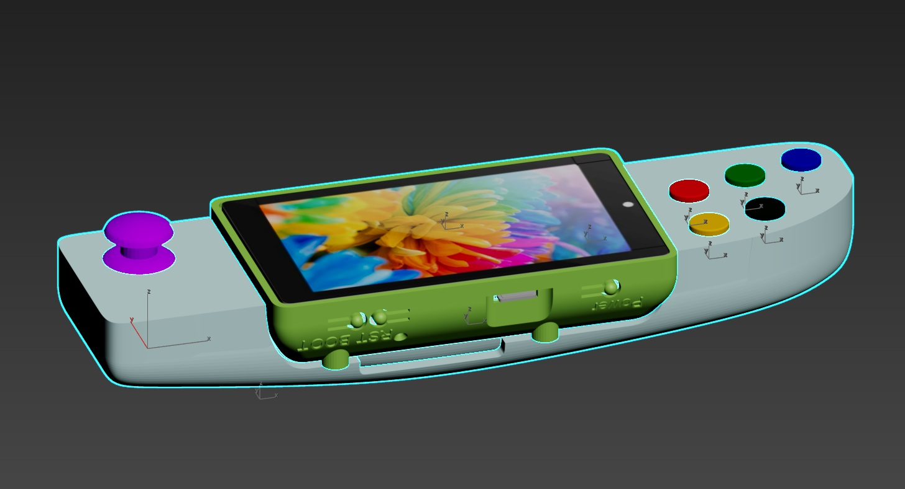
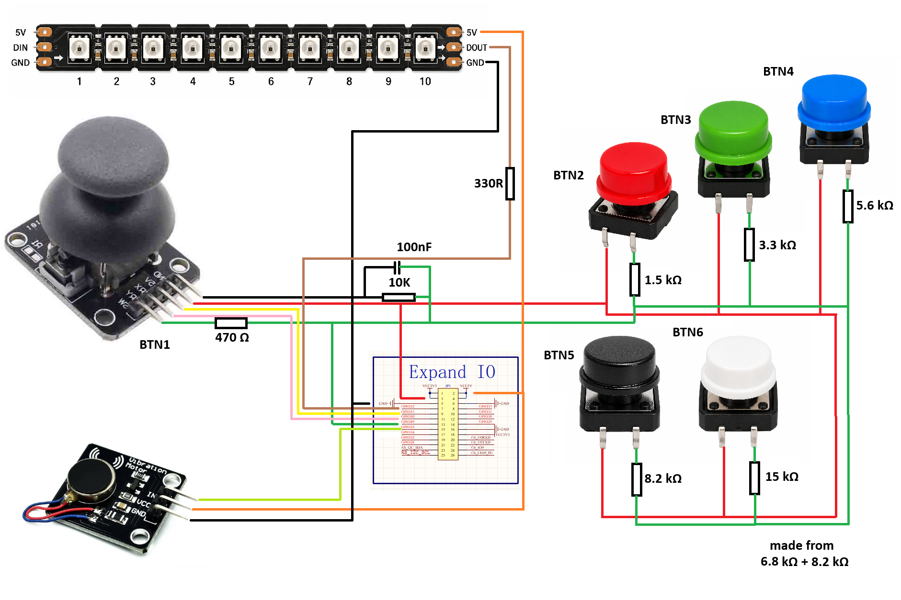
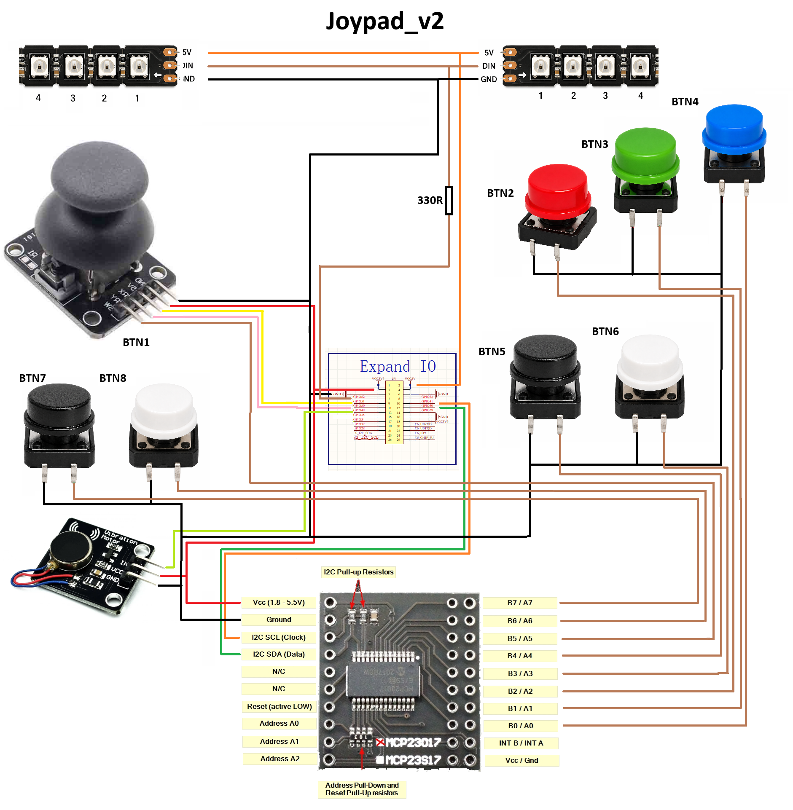
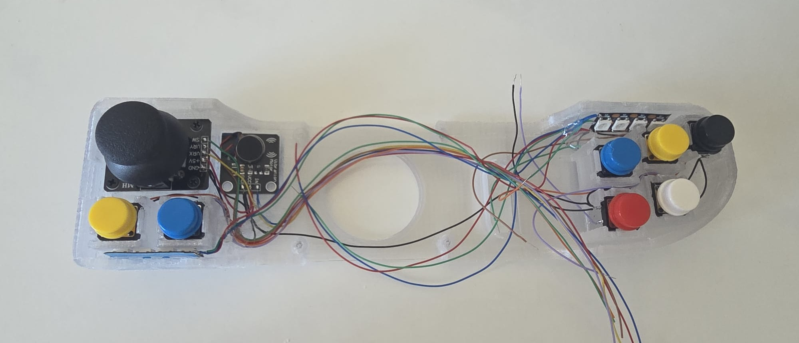
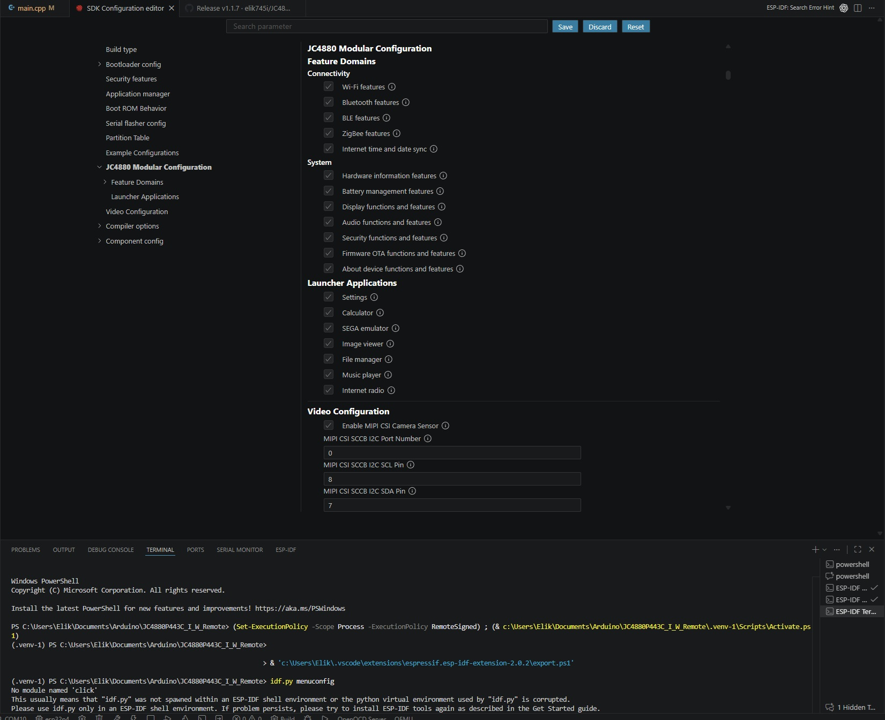
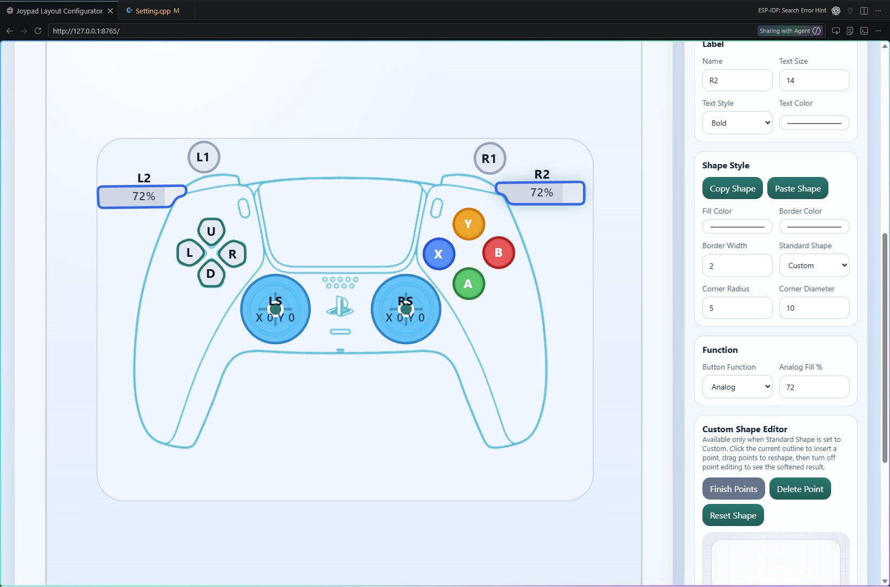

# JC4880P443C_I_W_Remote

Version 1.3.1 custom firmware for the JC4880P443C_I_W / ESP32-P4 Function EV Board profile.

This project keeps the Espressif phone-style launcher experience, then extends it with a broader native app set, emulator support, better SD-card behavior, persistent Wi-Fi settings, timezone control, online firmware discovery, a local factory reset flow, and an external ESP32-C6 coprocessor firmware path for BLE and ZigBee features.

## Hardware And Case Renders

Screen module views:


Battery and speaker case v1:


Printable STL files for the enclosure and related 3D assets are stored in `3D/`, including the original V1 files, the updated V2 and V3 case variants, separate lid / ring / fix parts, and editable Max or 3MF source files for the enclosure work.

### Attachable Joystick Work In Progress

An attachable joystick accessory for the device is currently in progress. The repo already includes the current hardware view and the early wiring reference used for that add-on work.

Joystick view:



Joystick circuit draft:







## What Changed Versus The Vendor Base

Compared with the stock Espressif-based firmware stack used for this hardware profile, this build adds or changes the following:

- Files app for browsing both `/sdcard` and SPIFFS directly on the device.
- Internet Radio app with station discovery by popularity, country, language, and category.
- Native SEGA app with Master System, Game Gear, SG-1000, and Genesis / Mega Drive ROM support.
- SEGA browser now includes an optional FPS overlay toggle, and the in-game control surface is tuned for the rotated handheld presentation.
- Shared launcher icon set sized to fit the OTA partition budget.
- Persistent Wi-Fi credentials and reconnect behavior backed by NVS.
- Wi-Fi Settings now also includes device AP mode setup with saved hotspot enable, SSID, and password controls.
- Added a native Web Server launcher app with quick-access curtain control, local mDNS discovery, captive-portal friendly AP behavior, SD-card `/web` hosting with SPIFFS fallback, and an embedded recovery uploader when site files are missing.
- Display timezone dropdown in GMT format with saved preference storage.
- Auto timezone detection from the internet after Wi-Fi connects.
- Firmware screen factory reset button with confirmation and settings wipe.
- Firmware releases now publish OTA-detectable `.bin` assets directly instead of ZIP-only packages.
- GitHub OTA updates now follow release-asset redirects correctly, keep visible status during checks and flashes, preserve failure messages, and keep the final OTA verification worker on an internal stack so the update no longer panics at the end of flashing.
- OTA update awareness now runs in the background, supports automatic update start from the Firmware OTA page, keeps a passive update-available icon in the top bar, and can roll back automatically if a freshly updated image crashes before it is marked healthy.
- Power management now enables tickless idle and runtime light-sleep configuration on the main ESP32-P4 firmware so idle CPU utilization can drop instead of staying artificially high.
- Safer SD-card boot behavior so video playback is only enabled when MJPEG content is actually present.
- SPIFFS cleanup that removes bundled demo media and frees flash for larger OTA-safe application images.
- Additional low-risk PSRAM placement for radio preview workers, background service stacks, and emulator lookup / ROM buffers to preserve internal SRAM for time-sensitive work.
- Additional PSRAM-first placement now covers more subsystem memory, including NVS cache, mDNS allocations, NimBLE heap usage, the audio echo test buffer, and more background worker stacks.
- Internet radio buffering and MP3 recovery are more tolerant of malformed or slow streams, which reduces playback stalls.
- Firmware settings can browse GitHub releases directly and offer OTA updates from attached `.bin` assets.
- Dead launcher apps and unreachable video-player sources were removed to reduce maintenance surface and keep OTA builds within budget.
- Camera and 2048 were removed from the installed launcher set to reduce boot-time memory pressure and maintenance surface.
- MP3 probing and decode fallback behavior are more tolerant of malformed frames and stream sync loss.
- BLE and ZigBee features are now enabled through a matching ESP32-C6 coprocessor firmware release.
- The standalone ESP32-C6 release now includes the fixed ZigBee storage partition layout required for stable bring-up.
- Wi-Fi status in the top bar now follows real connection state and signal strength updates more reliably.
- The Wi-Fi settings page now uses an explicit full-width `Scan` action instead of background auto-scan, which avoids dropdown races and makes scan timing predictable.
- Saved networks now stay connectable without live availability gating, and failed attempts can fall back to the previously connected network instead of leaving the device disconnected.
- Intentional disconnect flows no longer trigger automatic reconnect recovery, so a manual disconnect can keep Wi-Fi offline until the user asks for another connection.
- BLE startup, teardown, and disconnect recovery on the ESP-Hosted path were hardened to avoid stuck startup states and disconnect-time crashes.
- BLE game controller support now runs through the ESP32-C6 coprocessor with Bluepad32-based report forwarding, analog sticks and triggers, and broader controller button coverage.
- The BLE controller settings page now includes a live controller visualizer, persistent per-controller calibration storage, and calibration profile reuse across reconnects.
- Joypad layout editing now uses a dedicated local configurator that reads and regenerates the firmware layout header directly, supports BLE and Local controller targets, and lets controller artwork be refreshed alongside the generated LVGL asset.
- The BLE controller preview now follows the generated Joypad layout live on-device, including layout-driven buttons, triggers, and calibration-centered stick movement instead of the old split preview path.
- The Local Controller path now supports analog X/Y inputs plus MCP23017-backed buttons with a live on-device preview, serial input diagnostics, and the additional `Key` action on the default MCP `B4` mapping.
- The Local Controller settings page now includes integrated WS2812 / Neopixel controls, configurable haptic GPIO and strength, and live test feedback for motor changes without blocking the rest of the UI.
- Battery sampling now detaches from ADC2 while the Local Controller is active so analog local inputs can run without the previous ADC2 ownership conflict.
- The settings UI now includes compact Bluetooth and ZigBee status icons used by the latest wireless status flow.
- Settings now exposes separate Media and System Sounds volume controls on the shared audio output path.
- Hardware Monitor now keeps one hour of background history in PSRAM for CPU load, SRAM, PSRAM, Wi-Fi, battery, and CPU temperature instead of sampling only while the page is open.
- Hardware Monitor SD-card status now follows the app-wide storage mount state, so it no longer disagrees with File Manager when the card is mounted and browsable.
- The Hardware Monitor page now relies on the common system back gesture instead of its own dedicated back button, and the duplicate non-functional temperature card was removed.
- Files, Music, and Radio startup paths were hardened to avoid preallocating unnecessary runtime memory before launch.
- Internal SRAM usage was reduced substantially by moving large SEGA emulator permanent buffers and tables into PSRAM-backed BSS.
- Additional SEGA emulator permanent RAM, preview buffers, and SMS / Genesis scratch state now live in PSRAM-backed BSS, which cuts fresh-boot internal SRAM pressure before the emulator is launched.
- Additional boot-time SRAM pressure was removed by deferring heavy Internet Radio, Image Display, and SEGA UI/runtime setup until first launch.
- The unused camera and deep-learning component stack was removed from the resolved build graph to reduce flash footprint and memory pressure.
- Settings shutdown and modal-close flows were hardened against stale LVGL object updates that could previously trigger a panic during screen teardown.
- Music Player runtime metadata, library indexes, and long-lived worker stacks now prefer PSRAM, which reduces launch-time and background SRAM pressure.
- Music Player playlist confirmation dialogs now use safe LVGL async-close handling to avoid the panic that could occur when deleting or cancelling from the modal.
- Quick-access controls now stay available while apps are open, with a full-width power-and-audio curtain, smaller launcher row icons, and richer live Music Player detail in the strip.
- Internet Radio now mirrors Music Player-style top-bar quick actions for country station lists, including previous / next station controls and live buffering detail while the quick-access sheet is open.
- Internet Radio now exposes a live buffered-stream meter, larger playback modal layout, deeper PSRAM-first buffering, and delayed startup until the stream cache reaches a safer prefill level.
- Internet Radio steady-state downloading now refills in the background instead of blocking the audio playback path, which reduces refill-time audio dropouts on slow stations.
- Radio station catalogs, stream working buffers, and the shared audio playback task now prefer PSRAM more aggressively to preserve internal SRAM during radio use.
- Internet-backed Radio flows now fail fast when Wi-Fi has no usable IP or DNS, which avoids long timeout paths when the device is connected to Wi-Fi without real internet access.
- Radio app close/reopen handling now clears stale LVGL screen pointers on teardown, preventing the main-screen artifacts and close-time panic that could occur after failed online lookups.
- Attachable joystick hardware support is now being prepared in parallel with the main firmware and enclosure work, with the current mechanical and circuit references tracked in this repo.
- The repo now also includes newer attachable joystick enclosure assets and fresh 3D reference exports for the ongoing accessory fit work.
- Build-time modular configuration now exposes top-level menuconfig switches for major launcher apps and feature domains, so firmware variants can be trimmed without hand-editing code.
- Panic behavior now reboots automatically, and the next boot shows a short recovery popup that distinguishes crash, watchdog, brownout, and CPU lockup resets.
- Flash-backed core dump capture is now enabled, and the next boot persists a readable crash report under SPIFFS for later developer analysis.
- The reboot recovery popup can now show a manual `Report` action that tries to submit the saved crash report when Wi-Fi is connected, otherwise it reports that the device is offline or the private relay is not configured.
- Additional enclosure revisions and raw CAD exports are included under `3D/` for the updated hardware fit iterations.
- SEGA manual saves now use separate `SAVE` and `LOAD` actions instead of auto-resume behavior, so launching a ROM always starts from a clean boot unless a valid save is chosen explicitly.
- The SEGA load flow now pauses emulation and shows a rotated save-slot picker with up to five recent preview thumbnails pulled from SD-card save folders, with load-button state and preview orientation kept in sync with the active handheld rotation.
- Genesis save-state loading now restores the full 68K register set and rejects older incompatible save files instead of crashing after load.
- The SEGA browser now keeps the top bar visible on entry and return-from-game while gameplay itself stays fullscreen.
- The SEGA browser header and save-slot picker scrolling were cleaned up so the title no longer overlaps and the horizontal save list no longer recenters itself while browsing.
- Genesis runtime timing, audio pacing, and framebuffer rotation were tuned further to match the handheld layout and reduce slow-background-music behavior.
- On-screen keyboards now share the same shift and password-toggle behavior across Settings, File Manager, Music Player, and other text-entry flows.

## Feature Summary

### Launcher And Native Apps

- Phone-style launcher UI based on ESP-Brookesia and LVGL.
- Settings, Calculator, Files, Music Player, Internet Radio, Image Display, and SEGA Emulator.
- SEGA Emulator app integrated into the launcher instead of living as a separate upstream project.

### Media And Storage

- Files app can inspect both onboard SPIFFS and the SD card.
- Music and image sample payloads were removed from SPIFFS to save flash.
- The firmware updater can scan `/sdcard/firmware` for local `.bin` images or check GitHub releases for OTA-ready `.bin` assets.

### Wi-Fi, Time, And Settings

- Saved Wi-Fi credentials persist across reboots and reconnect automatically.
- Wi-Fi scanning is now manual from Settings with a dedicated `Scan` button placed below the saved-network card.
- Pressing `Scan` while Wi-Fi is off turns Wi-Fi on first, then launches the scan through the normal init path.
- Saved networks remain connectable even if they are not in the latest scan result set.
- Failed switches to unavailable saved networks can restore the previously connected network automatically.
- Intentional disconnects no longer trigger unwanted reconnect attempts.
- Wi-Fi Settings can also run the device as an AP with editable SSID and password fields from the same screen.
- Signal strength and scan results are exposed in Settings.
- System time is sourced from SNTP and converted with the configured local timezone.
- Manual timezone selection is available in GMT offsets.
- Auto timezone mode can update the offset from online geolocation when internet access is available.
- Factory Reset in Settings > Firmware clears the app preferences namespace and reapplies defaults immediately.

### Stability And Crash Recovery

- Panic and watchdog resets now reboot back into the launcher instead of halting on a dead screen.
- The next boot shows a short recovery popup with the general reset cause so failures are visible without opening a serial monitor.
- Core dumps are stored in a dedicated flash partition and summarized into a text crash report on boot.
- Crash reports are saved locally in SPIFFS and can be manually submitted from the recovery popup when Wi-Fi is available.

### Wireless Coprocessor

- BLE and ZigBee runtime support depends on the external ESP32-C6 coprocessor firmware published in the matching GitHub release.
- If the C6 is not flashed with the firmware from the same release, BLE and ZigBee features on the P4 side are not expected to work correctly.
- The C6 firmware is built from `coprocessor_c6/` and is released alongside the main P4 firmware.

### Game Controller Support

- BLE controller support is tested with the TOBO BSP-D9 game controller.
- Controller manual: [TOBO BSP-D9 manual](User_Manual/Tobo%20BSP%20D9.pdf).
- To pair the TOBO BSP-D9 with the unit, turn on `BLE Controller` in Settings, then press `HOME+X` on the controller.
- Reflash the ESP32-C6 first with the coprocessor binary from the [latest release](https://github.com/elik745i/JC4880P443C_I_W_Remote/releases/latest), otherwise controller pairing on the P4 side is not expected to work correctly.
- Local Controller mode also supports a directly wired handheld setup with analog `Y Axis` / `X Axis` inputs on the P4 and MCP23017 button expansion over I2C.
- The default MCP23017 Local Controller dropdowns are `Y Axis GPIO = 50`, `X Axis GPIO = 51`, `MCP SDA GPIO = 30`, `MCP SCL GPIO = 31`, `Start = B5`, `Exit = B3`, `Save = B7`, `Load = B6`, `A = B2`, `B = B1`, `C = B0`, and `Key = B4`.
- The Local Controller preview is live on-device and reflects analog movement plus MCP-backed face and action buttons, including `Save`, `Load`, `Exit`, and `Key`.
- Local Controller settings also expose non-blocking Neopixel and haptic feedback controls, including effect selection, brightness, GPIO routing, and haptic strength test pulses.

### Emulator Support

- The SEGA app scans `/sdcard/sega_games` for `.sms`, `.gg`, `.sg`, `.md`, `.gen`, `.bin`, and `.smd` ROMs.
- SMS and Game Gear battery saves are written next to the ROM as `.sav` sidecars.
- Genesis / Mega Drive support is integrated through the adapted Gwenesis path.
- Manual save states are stored under `/sdcard/saved_games/<game>_<hash>/` with up to five recent slots and thumbnail previews.
- The in-game `LOAD` action opens a rotated preview picker and pauses the emulator until a slot is chosen or cancelled.

## Hardware Target

- ESP32-P4 Function EV Board based target.
- 7-inch 1024x600 MIPI-DSI display using EK79007-compatible support.
- USB-C for power, flashing, and serial monitoring.
- Optional SD card for media, firmware packages, and emulator ROMs.

## Storage And OTA Layout

- Flash size is configured for 16 MB.
- Partition table provides OTA app slots of `0x7B0000` and `0x790000`, with the smaller slot defining the real OTA size ceiling.
- A dedicated `0x020000` flash coredump partition is reserved for post-crash diagnostics.
- SPIFFS storage remains `0x080000` while preserving the remaining onboard filesystem features.
- Version 1.3.1 validates at `0x6EF1F0`, leaving `0x0A0E10` bytes free in the smaller OTA app slot.

## SD Card Layout

- `/sdcard/music` for music content.
- `/sdcard/image` for image content.
- `/sdcard/sega_games` for SEGA ROMs.
- `/sdcard/saved_games` for SEGA manual save-state folders and preview thumbnails.
- `/sdcard/firmware` for local `.bin` firmware packages.

## Build

This project targets ESP-IDF 5.5.x and `esp32p4`.

The main ESP-IDF project and generated P4 firmware image are now named `ESP32P4_Remote`.

### Modular Build Configuration

The ESP-IDF equivalent of a project `configuration.ini` in this repo is `menuconfig` / `sdkconfig`.

This firmware now exposes a top-level `JC4880 Modular Configuration` menu where a programmer can enable or disable major launcher apps and major feature domains before building.



Current modular switches include:

- Connectivity domains: Wi-Fi, Bluetooth, BLE, ZigBee, internet time/date sync.
- System domains: hardware info, battery, display, audio, security, OTA, about-device.
- Launcher apps: Settings, Calculator, SEGA Emulator, Image Viewer, File Manager, Music Player, Internet Radio.

Within the Settings app, these feature flags now also gate the actual Settings sections and their supporting runtime work. For example, disabling BLE removes the Bluetooth entry from Settings and skips its startup path, and disabling OTA removes the firmware updater entry and screen.

Current limitation:

- `CONFIG_JC4880_FEATURE_BATTERY` is reserved for a future dedicated battery screen/card. The existing hardware monitor is currently gated by the broader hardware domain.

### How To Open The Config UI

Run `menuconfig` from the project root:

```text
C:\Users\Elik\Documents\Arduino\JC4880P443C_I_W_Remote
```

If you are using the ESP-IDF extension in VS Code, the simplest path is to open an `ESP-IDF Terminal` and run:

```bash
idf.py menuconfig
```

If you are in a normal PowerShell terminal and accidentally activated a Python virtual environment such as `.venv` or `.venv-1`, leave that environment first. `idf.py` must use the ESP-IDF-managed Python environment, not a project venv.

PowerShell example:

```powershell
deactivate
& "C:\Espressif\frameworks\esp-idf-v5.5.4\export.ps1"
idf.py menuconfig
```

If the ESP-IDF extension is configured correctly, you can also use its SDK Configuration Editor instead of typing the command manually.

Open the config UI with:

```bash
idf.py menuconfig
```

Then go to:

```text
JC4880 Modular Configuration
```

Inside that menu:

- Open `Feature Domains` to control top-level platform capabilities such as Wi-Fi, Bluetooth, BLE, ZigBee, OTA, audio, display, and security.
- Open `Launcher Applications` to include or exclude whole apps from the launcher build.
- Save before exiting so the selected values are written into `sdkconfig`.

The generated file updated by `menuconfig` is `sdkconfig`. The option definitions themselves live in `components/apps/Kconfig.projbuild`.

Example `sdkconfig` values:

```text
CONFIG_JC4880_APP_SETTINGS=y
# CONFIG_JC4880_APP_INTERNET_RADIO is not set
CONFIG_JC4880_FEATURE_WIFI=y
```

That means:

- Settings app is enabled.
- Internet Radio app is disabled.
- Wi-Fi feature domain is enabled.

If you prefer editing by hand instead of using the UI, you can modify the `CONFIG_JC4880_*` lines in `sdkconfig` directly, then rebuild. The UI is still the safer path because it preserves dependencies.

### Typical Command Examples

Open the configuration editor:

```bash
idf.py menuconfig
```

Rebuild after changing switches:

```bash
idf.py build
```

Build and flash to the board:

```bash
idf.py -p COM10 flash
```

Build, flash, and open the serial monitor:

```bash
idf.py -p COM10 flash monitor
```

After changing the switches, rebuild and flash as usual:

```bash
idf.py set-target esp32p4
idf.py build
```

To flash and open the serial monitor:

```bash
idf.py -p PORT flash monitor
```

### Preset Profiles

The repo now includes three ready-made modular profiles:

- `sdkconfig.defaults.full`
- `sdkconfig.defaults.media`
- `sdkconfig.defaults.minimal`

To build one of those profiles without replacing your current checked-in `sdkconfig.defaults`, layer it on top of the base defaults:

```bash
idf.py -D SDKCONFIG_DEFAULTS="sdkconfig.defaults;sdkconfig.defaults.media" reconfigure build
```

Swap `sdkconfig.defaults.media` for `sdkconfig.defaults.full` or `sdkconfig.defaults.minimal` as needed.

Examples:

Build the full profile:

```bash
idf.py -D SDKCONFIG_DEFAULTS="sdkconfig.defaults;sdkconfig.defaults.full" reconfigure build
```

Build the media profile:

```bash
idf.py -D SDKCONFIG_DEFAULTS="sdkconfig.defaults;sdkconfig.defaults.media" reconfigure build
```

Build the minimal profile:

```bash
idf.py -D SDKCONFIG_DEFAULTS="sdkconfig.defaults;sdkconfig.defaults.minimal" reconfigure build
```

These preset commands are useful when you want repeatable build variants without manually flipping many switches in `menuconfig` each time.

### Common Configuration Errors

If `idf.py menuconfig` fails, the problem is usually the shell environment rather than the project.

`No module named 'click'`

- Cause: `idf.py` was launched from a normal Python virtual environment such as `.venv` or `.venv-1` instead of the ESP-IDF Python environment.
- Fix: leave the Python venv, load ESP-IDF, then run `idf.py` again.

```powershell
deactivate
& "C:\Espressif\frameworks\esp-idf-v5.5.4\export.ps1"
idf.py menuconfig
```

`idf.py` works in the ESP-IDF extension but not in your terminal

- Cause: the VS Code extension has the right ESP-IDF environment loaded, but your normal terminal does not.
- Fix: use an `ESP-IDF Terminal` from the extension, or run the `export.ps1` command above in your shell first.

Wrong directory

- Cause: `idf.py` was run from `main/`, `components/`, or another subfolder instead of the project root.
- Fix: run it from:

```text
C:\Users\Elik\Documents\Arduino\JC4880P443C_I_W_Remote
```

Wrong serial port during flash

- Cause: the board COM port changed or the command used the wrong port.
- Fix: use the correct port explicitly, for example:

```bash
idf.py -p COM10 flash monitor
```

If flash fails, re-check Device Manager or the ESP-IDF port selector in VS Code.

Build does not reflect changed config

- Cause: the project needs a rebuild or reconfigure after `sdkconfig` changes.
- Fix: run:

```bash
idf.py reconfigure build
```

If you changed preset defaults with `SDKCONFIG_DEFAULTS`, keep using the same command line for that profile so the build graph stays consistent.

## Joypad Layout Configurator

The BLE controller overlay layout editor lives under `tools/joypad_layout/` and runs as a small local web app inside VS Code.

### Start It In VS Code

Run the VS Code task:

```text
JC4880: Joypad Layout Configurator
```

That task starts this command in a terminal:

```powershell
& "C:\Users\Elik\.espressif\python_env\idf5.5_py3.12_env\Scripts\python.exe" "${workspaceFolder}\tools\joypad_layout\server.py"
```

The server listens on:

```text
http://127.0.0.1:8765/
```

To open it in a VS Code tab like the integrated browser tab already used during development, open that URL inside VS Code after the task is running.



### Stop It

The configurator is only a local localhost server. To shut it down, stop the terminal or task that is running `server.py`.

Common ways in VS Code:

- Press `Ctrl+C` in the terminal that is running `JC4880: Joypad Layout Configurator`.
- Use `Tasks: Terminate Task` and select `JC4880: Joypad Layout Configurator`.
- Kill the terminal tab that is hosting the task.

### What The Buttons Do

- `Read`: reloads both BLE and Local controller layouts from `components/apps/setting/joypad/SettingJoypadLayout.hpp`, then refreshes `tools/joypad_layout/joypad_layout.json` from that generated source of truth.
- `Apply`: writes the current configurator state back into `tools/joypad_layout/joypad_layout.json` and regenerates `components/apps/setting/joypad/SettingJoypadLayout.hpp`.

The generated header is the authoritative layout source used by firmware builds. `Apply` only updates code artifacts, so build and flash remain manual steps.

### Background PNG Replacement

The configurator also lets you replace the default controller background PNG.

When you choose a PNG and press `Replace Background PNG`, the tool updates:

- `3D/map/controller.png` for the web preview.
- `components/apps/setting/ui/images/ui_img_controller_png.c` for the firmware image asset.

That means the next firmware build and flash will use the same background artwork that the configurator preview is showing.

Typical follow-up flow:

```text
1. Run JC4880: Joypad Layout Configurator
2. Adjust layout or replace the background PNG
3. Press Apply if you changed layout geometry or visuals
4. Build with JC4880: Build P4 or flash with JC4880: Build and Flash P4
```

## VS Code Flash Target Switch

If you want one simple switch in VS Code to choose whether to flash the main P4 firmware or the external C6 firmware, use the local workspace settings and task created in `.vscode/settings.json` and `.vscode/tasks.json`.

Important:

- This repo keeps the root ESP-IDF target as `esp32p4`.
- Do not use the ESP-IDF status bar target picker to switch the root project to `esp32c6` just to flash the coprocessor.
- Instead, switch the local flash selector and run the matching task.

In `.vscode/settings.json`, change:

```jsonc
"jc4880.flashTarget": "p4"
```

Valid values are:

- `p4` to flash the main ESP32-P4 firmware.
- `c6` to flash the ESP32-C6 coprocessor firmware.

The local COM ports are configured with:

```jsonc
"jc4880.ports.p4": "COM10",
"jc4880.ports.c6": "COM12"
```

After changing the selector, run the VS Code task:

```text
JC4880: Flash Selected Target
```

That task flashes the latest built image for the selected target.

## C6 Firmware Requirement

BLE and ZigBee features require the ESP32-C6 coprocessor to be flashed with the matching firmware from the same GitHub release as the P4 firmware.

Use the release assets for both devices together:

- Flash the P4 with the P4 firmware from the release.
- Flash the C6 with the C6 firmware from the same release.
- Do not mix older C6 firmware with a newer P4 release if you expect BLE or ZigBee to work.

## Flashing The ESP32-C6


To flash the C6 from an external UART bridge, connect the bridge to the board header like this:

- `RX -> TX`
- `TX -> RX`
- `GND -> GND`
- `5V -> 5V`

To put the C6 into boot mode:

1. Pull `C6_IO9` to `GND`.
2. Connect USB to the PC.
3. Put the P4 side into boot mode as well so it does not interfere with the C6: press `BOOT` and `RST`, then release `RST` so the screen stays in boot mode.
4. Release `C6_IO9` from `GND`.
5. Flash the C6 firmware.

This sequence keeps the P4 out of the way while the external UART bridge talks directly to the C6.

## Project Layout

- `main/` boot flow and app installation.
- `components/apps/` native applications and emulator integration.
- `common_components/` board-specific and locally adapted support code.
- `managed_components/` ESP Component Manager dependencies.
- `third_party/` imported upstream code adapted into this firmware.
- `spiffs/` bundled non-media filesystem assets.

## Upstream Sources And Attributions

The firmware in this repository adapts upstream vendor and emulator code. These are the primary sources that should be credited when redistributing or reviewing changes:

- Espressif ESP-Brookesia: https://github.com/espressif/esp-brookesia
- Espressif ESP-WiFi-Remote component: https://components.espressif.com/components/espressif/esp_wifi_remote
- Espressif WiFi Remote over EPPP component: https://components.espressif.com/components/espressif/wifi_remote_over_eppp
- Espressif ESP32-P4 Function EV Board BSP: https://components.espressif.com/components/espressif/esp32_p4_function_ev_board
- Retro-Go upstream: https://github.com/ducalex/retro-go
- SMS Plus GX upstream: https://github.com/ekeeke/smsplus-gx

The local emulator integration under `components/apps/sega_emulator/` and the vendor-facing launcher / board adaptations in this repository were modified to fit the JC4880P443C_I_W firmware, storage layout, UI flow, and OTA constraints.

## Repository

GitHub repository:

```text
https://github.com/elik745i/JC4880P443C_I_W_Remote
```

## Development Article

External write-up covering the device bring-up, hardware experiments, ESP-IDF migration, case work, and overall project direction:

- DRIVE2: [Очень экспериментальный проект, на этот раз все ближе.кудато.](https://www.drive2.ru/c/731630706236595501/)
